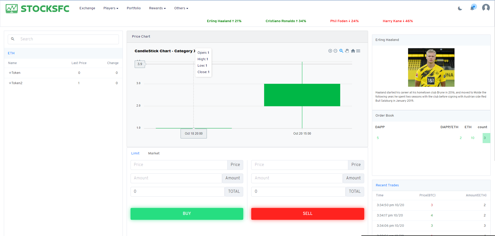

# BlockChain_Exchange

This is exchange site for ethereum

## Welcome Everyone

## Recommanded development environment

- Node.js 14.15.0
- truffle
- ganache
- web3.js

## Skill

- Node.js
- Solidity smart contract
- Web3
- React

## How to run this code

- $ truffle complile
- $ truffle migrage --network development --reset

## Run test net

You should run Ganache

## Install NPM modules

- $ yarn install
- $ yarn start

## Visit your site

http://localhost:3000

## Extra

You must run ganache before you run website

### Default login

- username : ccc@gmail.com
- password : 123123
- This is the login information on firebase
- you cant login without firebase database.

1. run 'npm install --force'
2. open ganache and run with 0 gas price
3. run truffle migrate
4. copy src/abis/token.json and token2.json to src/store/interactions/tokens
5. copy src/abis/exchange.json and exchange2.json to /src/interactions/exchange
6. npm start, login create account
